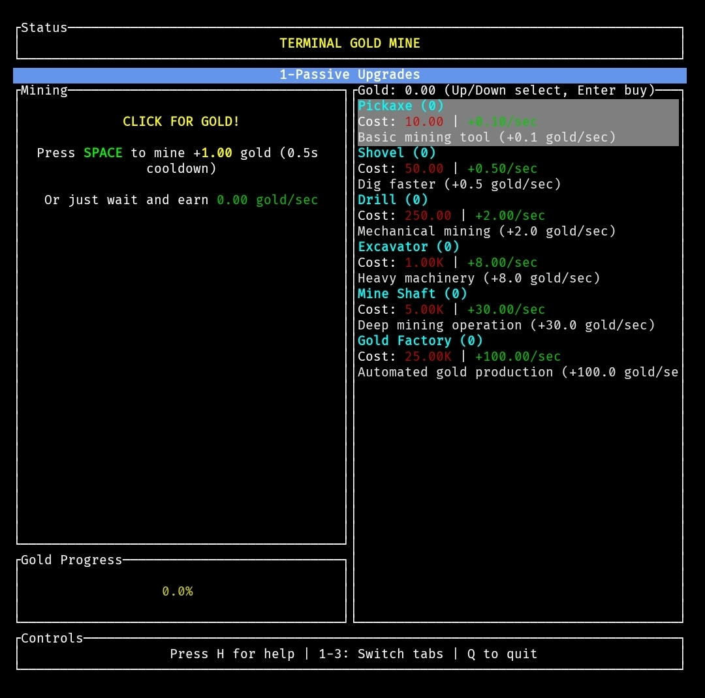

# TUI Idle Game



A terminal-based idle game built with Rust and ratatui. Players mine gold automatically and purchase upgrades to increase production rates.

## Features

* **Tabbed Interface** - Three distinct tabs for different gameplay aspects
* **Passive Income** - Automatic gold generation from passive upgrades
* **Active Clicking** - Manual gold mining with click power upgrades
* **Achievement System** - 8 long-term goals tracking various milestones
* **Real-time Updates** - Live statistics and progress tracking
* **Exponential Scaling** - Strategic upgrade purchasing with increasing costs

## Requirements

* Rust 1.70 or later
* Terminal supporting ANSI escape sequences

## Installation

```bash
git clone https://github.com/Cod-e-Codes/tui-idle-game.git
cd tui-idle-game
cargo run
```

## Controls

* `Space` - Mine gold manually (0.5s cooldown)
* `↑/↓` - Navigate upgrade/achievement list
* `Enter` - Purchase selected upgrade
* `1/2/3` - Switch between tabs (Passive/Click/Achievements)
* `H` - Toggle help display
* `Q` - Quit game

## Game Tabs

### 1. Passive Upgrades
Automatic gold generation - earn gold over time without clicking.

| Item | Base Cost | Production | Cost Multiplier |
|------|-----------|------------|-----------------|
| Pickaxe | 10 | 0.1 gold/sec | 1.15x |
| Shovel | 50 | 0.5 gold/sec | 1.15x |
| Drill | 250 | 2.0 gold/sec | 1.15x |
| Excavator | 1,000 | 8.0 gold/sec | 1.15x |
| Mine Shaft | 5,000 | 30.0 gold/sec | 1.15x |
| Gold Factory | 25,000 | 100.0 gold/sec | 1.15x |

### 2. Click Upgrades
Increase gold earned per manual click.

| Item | Base Cost | Click Power | Cost Multiplier |
|------|-----------|-------------|-----------------|
| Strong Arms | 25 | +1 gold/click | 1.2x |
| Steel Tools | 100 | +2 gold/click | 1.2x |
| Power Gloves | 500 | +5 gold/click | 1.2x |
| Hydraulic Hammer | 2,500 | +10 gold/click | 1.2x |
| Diamond Drill Bit | 10,000 | +25 gold/click | 1.2x |

### 3. Achievements
Long-term goals that track your progress:
* **First Steps** - Earn 100 total gold
* **Getting Rich** - Earn 10,000 total gold
* **Millionaire** - Earn 1,000,000 total gold
* **Passive Income** - Reach 10 gold per second
* **Gold Rush** - Reach 100 gold per second
* **Click Master** - Click 1,000 times
* **Power Clicker** - Reach 50 gold per click
* **Upgrade Collector** - Purchase 50 upgrades

## License

MIT License
